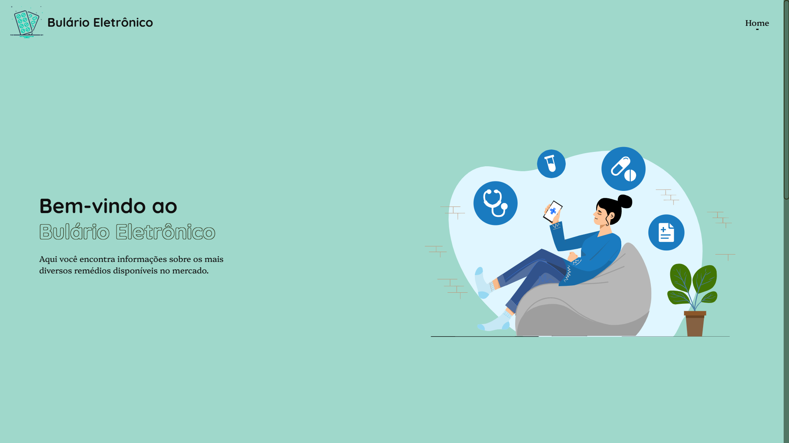

# Bulario

> Status : Finished project ✅ / Open PR

## Dotlib - Challenge 🎯

_Technologies_

- Vite ⚡
- SASS 🎨
- React Router Dom 📍
- TypeScript 📚
- Axios 🌐
- AOS (Animate On Scroll) 📈
- Lottie 🎥

### Requirements
- Node.js (v20.15.0) or higher
- NPM (v10.8.1)

### How to use

- git clone https://github.com/12Gustavo21/bulario.git or download the zip
- npm install or yarn install
- code . (if you use VSCode)
- npm run dev or yarn dev

## 💻 Online Page: https://bularioeletronico.vercel.app